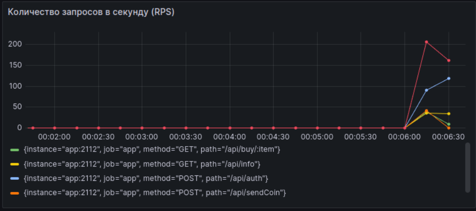

# Магазин мерча для сотрудников

> [Техническое задание](./TASKS.md)

## Оглавление
- [Описание задачи](#описание-задачи)
- [Стек технологий](#стек-технологий)
- [Описание API](#описание-api)
  - [Сценарии использования](#сценарии-использования)
- [Запуск проекта](#запуск-проекта)
- [Документация API](#документация-api)
- [Тесты](#тесты)
- [Как запустить нагрузочное тестирование](#как-запустить-нагрузочное-тестирование)
- [Линтер](#линтер)

## Описание задачи

Сервис позволяет сотрудникам:

- Просматривать список приобретенных товаров.
- Смотреть информацию о движении монеток в их кошельке, включая:
  - Кто передавал монеты и в каком количестве.
  - Кому сотрудник передавал монеты и в каком количестве.

## Стек технологий

- **Язык сервиса:** Go
- **База данных:** PostgreSQL
- **Контейнеризация:** Docker, Docker Compose
- **Авторизация:** JWT
- **Мониторинг и метрики:**
Prometheus, Grafana, k6 

## Описание API

Для работы с API необходимо выполнить авторизацию с использованием JWT. Пользовательский токен доступа выдается после регистрации/авторизации.

### Сценарии использования

1. **Авторизация / Регистрация:** После первой авторизации пользователь создается автоматически.
2. **Покупка товара:** Сотрудники могут покупать мерч, используя монеты.
3. **Передача монет:** Сотрудники могут передавать монеты другим сотрудникам в знак благодарности или подарка.
4. **История транзакций**: Сотрудники могут увидеть историю покупок и ифнормацию о движении монеток в их кошельке

## Запуск проекта

Для запуска сервиса и базы данных необходимо использовать Docker Compose. Инструкция по запуску:

1. Клонируйте репозиторий на свой локальный компьютер.

        git clone git@github.com:merynayr/AvitoShop.git && cd AvitoShop

2. Запустите контейнеры с помощью Docker Compose:

        make docker-build
    или командой

        docker compose up --build -d

3. Вы должны увидеть вывод Docker, подтверждающий, что контейнеры успешно запущены. На этом этапе сервис будет доступен по следующему адресу:

        http://localhost:8080

4. Переменные окружения можно найти в файле .env.

5. Все команды можно найти в Makefile.
## Документация API

После запуска сервиса можно открыть документацию OpenAPI, она запускается на другом порту. Изменить порт можно в файле .env:

- Swagger UI: http://localhost:8093

## Тесты

Тесты выполняются тестовой базе данных в отдельном контейнере с портом 5433. Если менять его, то нужно изменить его в Docker-compose.yml и
Makefile и в файле ./internal/tests/integration_tests/config_test.go

- Необходимо провести миграции командой:
        
        make migration_for_test_up

- Запустить юнит-тесты можно командой:

        go test -v ./internal/tests/unit_tests/...

- Запустить интеграционные тесты можно командой:

        go test -v ./internal/tests/integration_tests/...

- Запустить все тесты можно командной:

        make test

- Запуск тестов с покрытием кода:

        make test-coverage

Будут запущены как юнит-тесты, так и интеграционные.
Все тесты можно найти в папке ./internal/tests.

## Как запустить нагрузочное тестирование

Нагрузочное тестирование проводилось с помощью k6. Тестовый файл: load-test.js. Рекомендую поменять найстройки подключения к БД приложения в файле .env.
    
    make load-testing

Миграции:

        make migration_for_test_up
        make migration_for_test_down

### Результаты при загрузке 1000 пользователей

- Количество запросов в секунду (RPS) – показывает, сколько запросов обрабатывается в секунду на протяжении всего теста.
- Время отклика (SLI Latency) – отображает продолжительность ответа от сервера, включая различные квантильные значения.
- Процент успешных ответов (99-й квантиль успешности) – демонстрирует, сколько процентов запросов было успешными, включая максимальные значения.

#### Графики:

## Линтер

В проекте используется линтер golangci-lint. Чтобы запустить его для проверки кода на ошибки, используйте команду:

    make lint

### Конфигурация линтера
Конфигурация линтера представлена в файле `.golangci.pipeline.yaml`.

